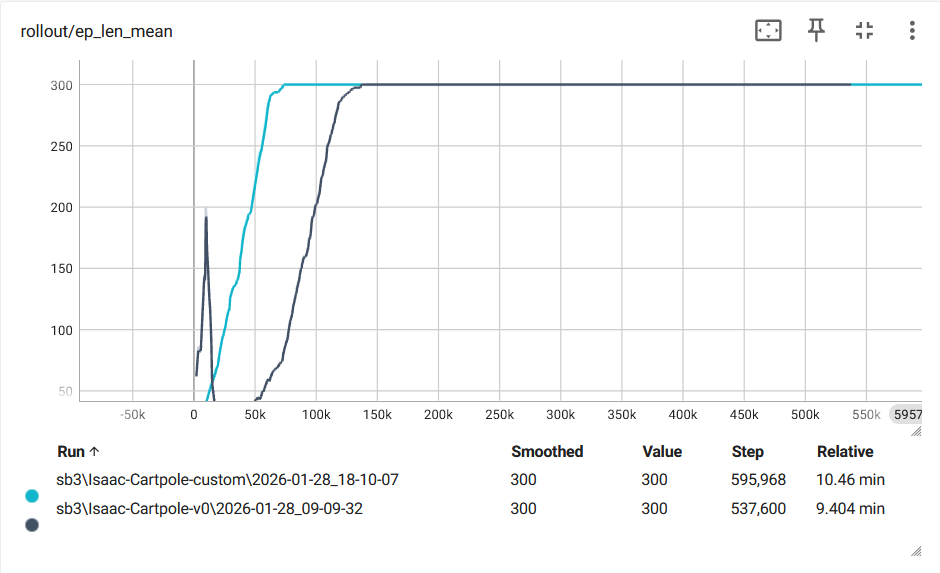
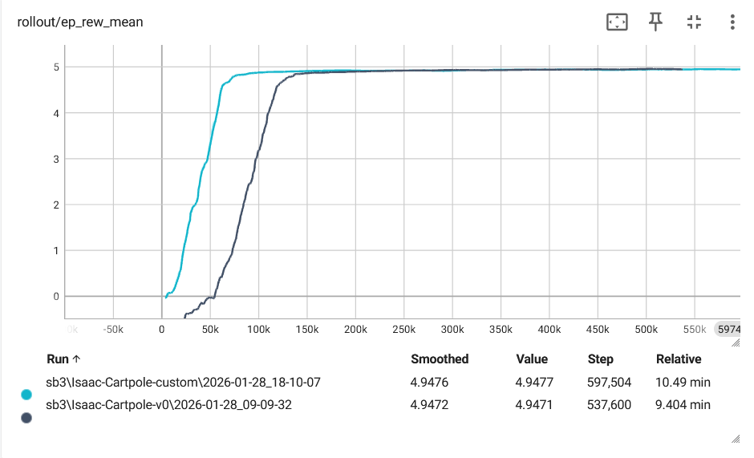

# Running script

1. For default cartpole environment.
```py
python scripts/sb3/train.py --task Isaac-Cartpole-v0 --num_env 32
```

2. For custom cartpole environment.
```py
python scripts/sb3/train.py --task RLENV-Cartpole --num_env 32
```

# Answer Questions
## Part One
1. According to the tutorials, if we want to edit the environment configuration, action space, observation space, reward function, or termination condition of the Isaac-Cartpole-v0 task, which file should we look at, and where is each part located?

    Answer:
    We can simply edit the env configuration file located at `./rlenv/cartpole/normal_cart_pole/cartpole_env_cfg.py` for this repository.

    There are configclass defined in this file for each part:
    - Environment configuration: `CartpoleEnvCfg`
    - Action space: `CartpoleActCfg`
    - Observation space: `CartpoleObsCfg`
    - Reward function: `CartpoleRewCfg`
    - Termination condition: `CartpoleTermCfg`

    Which need to be initialized in ManagerBasedRLEnvCfg class as:
    ```py
    class CartpoleEnvCfg(ManagerBasedRLEnvCfg):
        scene: CartpoleSceneCfg = CartpoleSceneCfg(num_envs=4096, env_spacing=4.0)
        observations: ObservationsCfg = ObservationsCfg()
        actions: ActionsCfg = ActionsCfg()
        events: EventCfg = EventCfg()
        rewards: RewardsCfg = RewardsCfg()
        terminations: TerminationsCfg = TerminationsCfg()
    ```

2. What are the action space and observation space for an agent defined in the Isaac-Cartpole-v0 task?

    Answer:
    - Action space: Discrete(2) - The agent can take two actions: push the cart to the left or push the cart to the right.
    - Observation space: Box(4) - The observation consists of four continuous values: cart position, cart velocity, pole angle, and pole angular velocity.

3. How can episodes in the Isaac-Cartpole-v0 task be terminated?

    Answer:
    There are two main conditions for terminating an episode in the Isaac-Cartpole-v0 task:
    1. The pole angle exceeds a certain threshold (e.g., 12 degrees from vertical).
    2. The cart position goes beyond a specified limit (e.g., 2.4 units from the center).


4. How many reward terms are used to train an agent in the Isaac-Cartpole-v0 task?

    Answer:
    There are four reward terms used to train an agent in the Isaac-Cartpole-v0 task:
    1. Reward for keeping the pole upright.
    2. Penalty for the cart moving away from the center.
    3. Penalty for large actions (to encourage smoother control).
    4. Bonus for each time step the pole remains balanced.

## Part Two
I've modified the terminate condition by adding a new condition that terminates when the pole angle is too low (i.e., when the pole is almost horizontal). 

```py
pole_out_of_bounds = DoneTerm(
    func=mdp.terminate_low_angle_pole,
    params={"asset_cfg": SceneEntityCfg("robot", joint_names=["cart_to_pole"])},
)

```

These plots show the results between `Isaac-Cartpole-v0` and my modified environment `RLENV-Cartpole` (custom).


- The custom one shows a higher episode length mean rapidly at the beginning.


- Same as eepisode length mean, the custom one shows a higher episode reward mean rapidly at the beginning.

Summary:
From the plots, we can see that the modified environment `RLENV-Cartpole` leads to better performance in terms of both episode length mean and episode reward mean compared to the default `Isaac-Cartpole-v0`. This indicates that the new termination condition may have encouraged the agent to converge faster.

## Part Three
1. What is reinforcement learning and its components according to your understanding? Giving examples of each component according to the diagram consider the Cartpole problem.

    Answer:
    Reinforcement Learning (RL) is a type of machine learning where an agent learns to make decisions by taking actions in an environment to maximize cumulative rewards. The main components of RL include:
    - Agent
    - Environment
    - State
    - Action
    - Reward

    In the Cartpole problem:
    - Agent: The controller that decides whether to push the cart left or right.
    - Environment: The Cartpole system itself, including the cart, pole, and physics.
    - State: The current observation of the system, which includes the cart position, cart velocity, pole angle, and pole angular velocity.
    - Action: The possible moves the agent can make, which are pushing the cart left or right.
    - Reward: The feedback signal that indicates how well the agent is performing.

2. What is the difference between the reward, return, and the value function?

    Answer:
    - Reward: The immediate feedback received by the agent after taking an action in a particular state. It indicates how good or bad that action was in that specific instance.
    - Return: The total accumulated reward that the agent receives over a sequence of time steps, often discounted over time. It represents the long-term benefit of a series of actions.
    - Value Function: A function that estimates the expected return (total future rewards) from a given state (or state-action pair). It helps the agent evaluate how good it is to be in a particular state or to take a specific action in that state.

3. Consider policy, state, value function, and model as mathematical functions, what would each one take as input and output?

    Answer:
    - Policy (π): 
    `State (s) --> Policy (π) --> (a) or Probability distribution over actions.`
    
    - State (s): 
    `Environment --> State (s) --> Observation vector`

    - Value Function (V or Q)
    `State (s), State-Action pair (s, a) --> Value Function --> Expected return (value).`

    - Model: 
    `Current state (s) and action (a) --> Model --> Next state (s') and reward (r).`